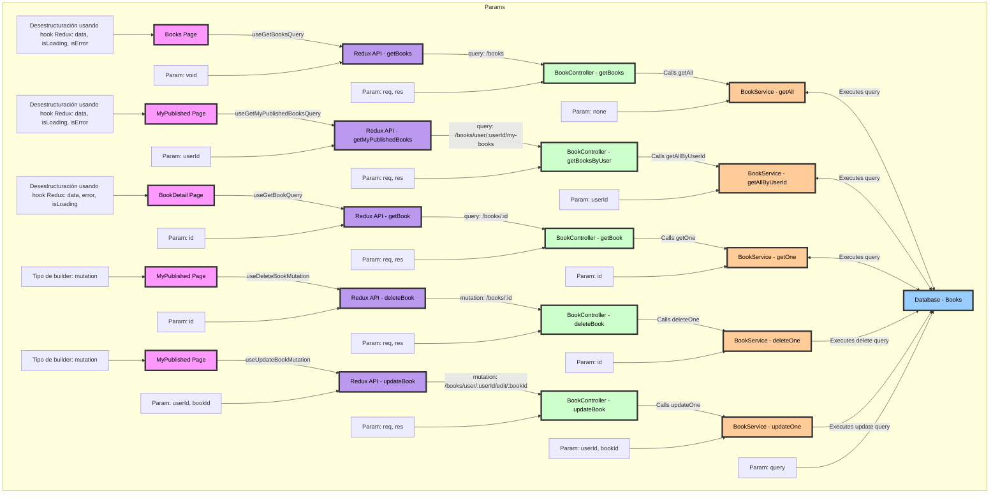

## Arbol de componentes

---

```mermaid

graph TD
    %% Definición de los componentes
    A[App.tsx]
    B[Welcome]
    C[Books]
    D[BookDetail]
    E[MyPublished]
    F[Login]
    G[Register]

    %% Conexiones
    A --> B
    A --> C
    A --> D
    A --> E
    A --> F
    A --> G

    %% Books component hierarchy
    C --> H[Spinner]
    C --> I[NavBar]
    C --> J[ModalNewBook]
    J --> K[PublicationForm]
    K --> L[Spinner]

    %% BookDetail component hierarchy
    D --> M[Spinner]
    D --> N[NavBar]
    D --> O[StarRating]

    %% MyPublished component hierarchy
    E --> P[Spinner]
    E --> Q[NavBar]
    E --> R[Notification]
    E --> S[ModalEditBook]
    S --> T[EditForm]
    T --> U[TextInput]
    T --> V[SelectInput]

    %% Login component hierarchy
    F --> W[LoginForm]
    W --> X[Spinner]

    %% Register component hierarchy
    G --> Y[RegisterForm]
    Y --> Z[Spinner]


    %% Estilos
    style A fill:#f9f,stroke:#333,stroke-width:4px,color:#000
    style B fill:#b9e,stroke:#333,stroke-width:4px,color:#000
    style C fill:#9cf,stroke:#333,stroke-width:4px,color:#000
    style D fill:#cfc,stroke:#333,stroke-width:4px,color:#000
    style E fill:#fc9,stroke:#333,stroke-width:4px,color:#000
    style F fill:#ff9,stroke:#333,stroke-width:4px,color:#000
    style G fill:#ff9,stroke:#333,stroke-width:4px,color:#000


    style H fill:#f9f,stroke:#333,stroke-width:4px,color:#000
    style I fill:#b9e,stroke:#333,stroke-width:4px,color:#000
    style J fill:#9cf,stroke:#333,stroke-width:4px,color:#000
    style K fill:#cfc,stroke:#333,stroke-width:4px,color:#000
    style L fill:#fc9,stroke:#333,stroke-width:4px,color:#000
    style M fill:#ff9,stroke:#333,stroke-width:4px,color:#000
    style N fill:#ff9,stroke:#333,stroke-width:4px,color:#000
    style O fill:#f9f,stroke:#333,stroke-width:4px,color:#000
    style P fill:#b9e,stroke:#333,stroke-width:4px,color:#000
    style Q fill:#9cf,stroke:#333,stroke-width:4px,color:#000
    style R fill:#cfc,stroke:#333,stroke-width:4px,color:#000
    style S fill:#fc9,stroke:#333,stroke-width:4px,color:#000
    style T fill:#ff9,stroke:#333,stroke-width:4px,color:#000
    style U fill:#ff9,stroke:#333,stroke-width:4px,color:#000
    style V fill:#f9f,stroke:#333,stroke-width:4px,color:#000
    style W fill:#b9e,stroke:#333,stroke-width:4px,color:#000
    style X fill:#9cf,stroke:#333,stroke-width:4,color:#000


```

## Descripción de la Conexión entre Componentes para las operaciones CRUD

---

```mermaid
graph

    %% Definición de los componentes
    A["Books Page"] -->|useGetBooksQuery| B["Redux API - getBooks"]
    B -->|query: /books| C["BookController - getBooks"]
    C -->|Calls getAll| D["BookService - getAll"]
    D <-->|Executes query| E["Database - Books"]

    %% Conexiones para obtener libros por usuario
    F["MyPublished Page"] -->|useGetMyPublishedBooksQuery| G["Redux API - getMyPublishedBooks"]
    G -->|query: /books/user/:userId/my-books| H["BookController - getBooksByUser"]
    H -->|Calls getAllByUserId| I["BookService - getAllByUserId"]
    I <-->|Executes query| E

    %% Conexiones para obtener un libro en particular
    J["BookDetail Page"] -->|useGetBookQuery| K["Redux API - getBook"]
    K -->|query: /books/:id| L["BookController - getBook"]
    L -->|Calls getOne| M["BookService - getOne"]
    M <-->|Executes query| E

    %% Conexiones para eliminar un libro
    N["MyPublished Page"] -->|useDeleteBookMutation| O["Redux API - deleteBook"]
    O -->|mutation: /books/:id| P["BookController - deleteBook"]
    P -->|Calls deleteOne| Q["BookService - deleteOne"]
    Q -->|Executes delete query| E

    %% Conexiones para editar un libro
    R["MyPublished Page"] -->|useUpdateBookMutation| S["Redux API - updateBook"]
    S -->|mutation: /books/user/:userId/edit/:bookId| T["BookController - updateBook"]
    T -->|Calls updateOne| U["BookService - updateOne"]
    U -->|Executes update query| E

    %% Detalles de los Props
    subgraph Params
        A1[Desestructuración usando hook Redux: data, isLoading, isError] --> A
        B1[Param: void] --> B
        C1[Param: req, res] --> C
        D1[Param: none] --> D

        F1[Desestructuración usando hook Redux: data, isLoading, isError] --> F
        G1[Param: userId] --> G
        H1[Param: req, res] --> H
        I1[Param: userId] --> I

        J1[Desestructuración usando hook Redux: data, error, isLoading] --> J
        K1[Param: id] --> K
        L1[Param: req, res] --> L
        M1[Param: id] --> M

        N1[Tipo de builder: mutation] --> N
        O1[Param: id] --> O
        P1[Param: req, res] --> P
        Q1[Param: id] --> Q

        R1[Tipo de builder: mutation] --> R
        S1[Param: userId, bookId] --> S
        T1[Param: req, res] --> T
        U1[Param: userId, bookId] --> U

        E1[Param: query] --> E
    end

    %% Estilos
    style A fill:#f9f,stroke:#333,stroke-width:4px,color:#000
    style B fill:#b9e,stroke:#333,stroke-width:4px,color:#000
    style C fill:#cfc,stroke:#333,stroke-width:4px,color:#000
    style D fill:#fc9,stroke:#333,stroke-width:4px,color:#000
    style E fill:#9cf,stroke:#333,stroke-width:4px,color:#000

    style F fill:#f9f,stroke:#333,stroke-width:4px,color:#000
    style G fill:#b9e,stroke:#333,stroke-width:4px,color:#000
    style H fill:#cfc,stroke:#333,stroke-width:4px,color:#000
    style I fill:#fc9,stroke:#333,stroke-width:4px,color:#000

    style J fill:#f9f,stroke:#333,stroke-width:4px,color:#000
    style K fill:#b9e,stroke:#333,stroke-width:4px,color:#000
    style L fill:#cfc,stroke:#333,stroke-width:4px,color:#000
    style M fill:#fc9,stroke:#333,stroke-width:4px,color:#000

    style N fill:#f9f,stroke:#333,stroke-width:4px,color:#000
    style O fill:#b9e,stroke:#333,stroke-width:4px,color:#000
    style P fill:#cfc,stroke:#333,stroke-width:4px,color:#000
    style Q fill:#fc9,stroke:#333,stroke-width:4px,color:#000

    style R fill:#f9f,stroke:#333,stroke-width:4px,color:#000
    style S fill:#b9e,stroke:#333,stroke-width:4px,color:#000
    style T fill:#cfc,stroke:#333,stroke-width:4px,color:#000
    style U fill:#fc9,stroke:#333,stroke-width:4px,color:#000


```
