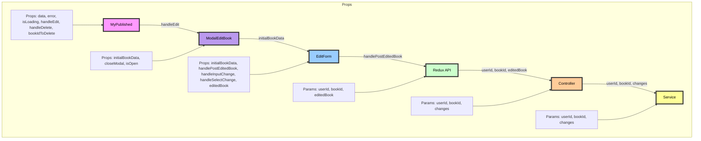
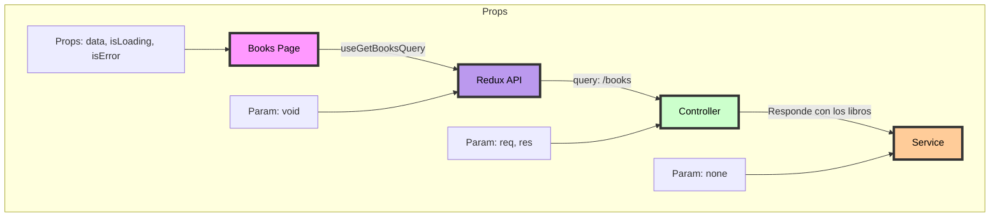
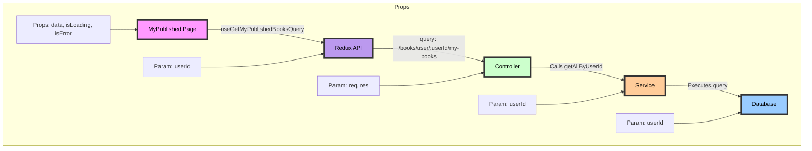
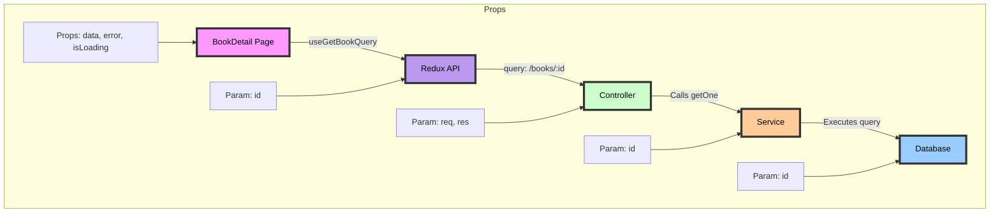
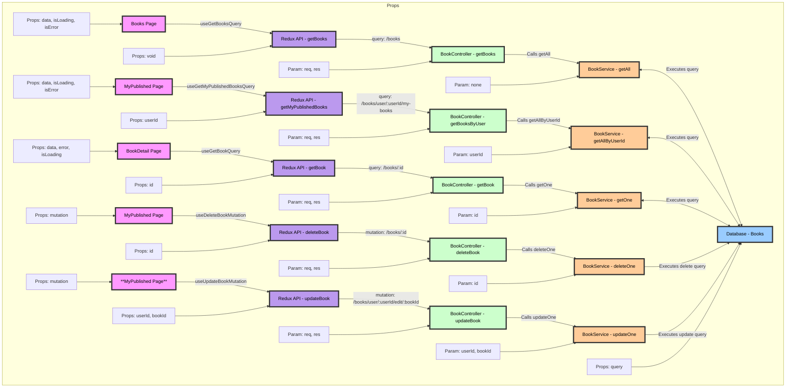

# Diagrama de Flujo Para la Edicion de un Libro

---

## Descripción de la Conexión entre Componentes

---

### MyPublished:

- **Props**: data, error, isLoading, handleEdit, handleDelete, bookIdToDelete.
- **Función principal:** Muestra la lista de libros publicados y maneja la edición/eliminación de libros.
- **Interacción:** Llama a handleEdit(book) que abre ModalEditBook.

### ModalEditBook:

- **Props:** initialBookData, closeModal, isOpen.
- **Función principal:** Muestra el formulario de edición de libro.
- **Interacción:** Pasa initialBookData a EditForm.

### EditForm:

- **Props:** initialBookData, handlePostEditedBook, handleInputChange, handleSelectChange, editedBook.
- **Función principal:** Formulario para editar los detalles del libro.
- **Interacción:** Llama a handlePostEditedBook que despacha Redux API (updateBook).

### Redux API (updateBook):

- **Params:** userId, bookId, editedBook.
- **Función principal:** Acción de Redux para actualizar un libro en el servidor.
- **Interacción:** Envia datos al Controller (updateBook).

### Controller (updateBook):

- **Params:** userId, bookId, changes.
- **Función principal:** Controlador del backend que maneja la solicitud de actualización.
- **Interacción:** Llama al Service (update).

### Service (update):

- **Params:** userId, bookId, changes.
- **Función principal:** Servicio que realiza la actualización en la base de datos.
- **Interacción:** Ejecuta la consulta SQL para actualizar el libro en la base de datos.

# Diagrama de Flujo Para la Creación de un Libro

---

## Descripción de la Conexión entre Componentes

---

### Books Page:

- **Props:** data, isLoading, isError.
- **Función principal:** Muestra la lista de libros y tiene un botón para abrir el modal de nuevo libro.
- **Interacción:** Llama a openModal para abrir ModalNewBook.

### ModalNewBook:

- **Props:** isOpen, setIsOpen.
- **Función principal:** Muestra el modal para crear un nuevo libro.
- **Interacción:** Pasa initialBookData a PublicationForm.

### PublicationForm:

- **Props:** initialBookData, handlePostNewBook, handleInputChange, handleSelectChange, dataNewBook.
- **Función principal:** Formulario para ingresar los detalles del nuevo libro.
- **Interacción:** Llama a handlePostNewBook que despacha la acción de Redux API (postNewBook).

### Redux API (postNewBook):

- **Param:** dataNewBook.
- **Función principal:** Acción de Redux para crear un nuevo libro en el servidor.
- **Interacción:** Envia dataNewBook al Controller (creteBook).

### Controller (creteBook):

- **Param:** bookDetails.
- **Función principal:** Controlador del backend que maneja la solicitud de creación.
- **Interacción:** Llama al Service (create).

### Service (create):

- **Param:** bookDetails.
- **Función principal:** Servicio que realiza la inserción en la base de datos.
- **Interacción:** Ejecuta la consulta SQL para crear el nuevo libro en la base de datos.

# Diagrama de Flujo Para la Eliminación de un Libro

---

## Descripción de la Conexión entre Componentes

---

### MyPublished:

- **Props:** data, error, isLoading, handleDelete, handleEdit, bookIdToDelete.
- **Función principal:** Muestra la lista de libros publicados y maneja la edición/eliminación de libros.
- **Interacción:** Llama a handleDelete(bookId) que abre Notification.

### Notification:

- **Props:** message, onConfirm, onCancel.
- **Función principal:** Muestra una notificación de confirmación para eliminar un libro.
- **Interacción:** onConfirm llama a la acción de Redux API (deleteBook).

### Redux API (deleteBook):

- **Param:** bookId.
- **Función principal:** Acción de Redux para eliminar un libro en el servidor.
- **Interacción:** Envia bookId al Controller (deleteBook).

### Controller (deleteBook):

- **Param:** id.
- **Función principal:** Controlador del backend que maneja la solicitud de eliminación.
- **Interacción:** Llama al Service (delete).

### Service (delete):

- **Param:** id.
- **Función principal:** Servicio que realiza la eliminación en la base de datos.
- **Interacción:** Ejecuta la consulta SQL para eliminar el libro de la base de datos.

# Diagrama de Flujo Para la Obtención de todos los Libros

---

## Descripción de la Conexión entre Componentes

---

### Books Page:

- **Props:** data, isLoading, isError.
- **Función principal:** Muestra la lista de libros disponibles.
- **Interacción:** Llama a useGetBooksQuery() que conecta con la API de Redux.

### Redux API (getBooks):

- **Param:** void.
- **Función principal:** Acción de Redux para obtener todos los libros del servidor.
- **Interacción:** Envía una solicitud GET a /books al Controller (getBooks).

### Controller (getBooks):

- **Param:** req, res.
- **Función principal:** Controlador del backend que maneja la solicitud para obtener todos los libros.
- **Interacción:** Llama al Service (getAll) para obtener los datos.

### Service (getAll):

- **Param:** none.
- **Función principal:** Servicio que realiza la consulta en la base de datos para obtener todos los libros.
- **Interacción:** Ejecuta la consulta SQL y devuelve los libros encontrados.

# Diagrama de Flujo Para la Obtención de Libros por usuario

---

## Descripción de la Conexión entre Componentes

### MyPublished Page:

- **Props:** data, isLoading, isError.
- **Función principal:** Muestra la lista de libros publicados por el usuario.
- **Interacción:** Llama a useGetMyPublishedBooksQuery(userId) que conecta con la API de Redux.

### Redux API (getMyPublishedBooks):

- **Param:** userId.
- **Función principal:** Acción de Redux para obtener todos los libros publicados por un usuario específico.
- **Interacción:** Envía una solicitud GET a /books/user/
  /my-books al Controller (getBooksByUser).

### Controller (getBooksByUser):

- **Param:** req, res.
- **Función principal:** Controlador del backend que maneja la solicitud para obtener todos los libros publicados por un usuario.
- **Interacción:** Llama al Service (getAllByUserId) para obtener los datos.

### Service (getAllByUserId):

- **Param:** userId.
- **Función principal:** Servicio que realiza la consulta en la base de datos para obtener todos los libros publicados por un usuario.
- **Interacción:** Ejecuta la consulta SQL y devuelve los libros encontrados.

### Database:

- **Param:** userId.
- **Función principal:** Almacena los datos de los libros y usuarios.
- **Interacción:** Ejecuta la consulta SQL y devuelve los libros encontrados para el usuario especificado.

# Diagrama de Flujo Para la Obtención de un libro por id

---

## Descripción de la Conexión entre Componentes

---

### BookDetail Page:

- **Props:** data, error, isLoading.
- **Función principal:** Muestra los detalles de un libro específico.
- **Interacción:** Llama a useGetBookQuery(id) que conecta con la API de Redux.

### Redux API (getBook):

- **Props:** id.
- **Función principal:** Acción de Redux para obtener los detalles de un libro específico.
- **Interacción:** Envía una solicitud GET a /books/ al Controller (getBook).

### Controller (getBook):

- **Props:** req, res.
- **Función principal:** Controlador del backend que maneja la solicitud para obtener los detalles de un libro específico.
- **Interacción:** Llama al Service (getOne) para obtener los datos.

### Service (getOne):

- **Props:** id.
- **Función principal:** Servicio que realiza la consulta en la base de datos para obtener los detalles de un libro específico.
- **Interacción:** Ejecuta la consulta SQL y devuelve los detalles del libro.

### Database:

- **Props:** id.
- **Función principal:** Almacena los datos de los libros y usuarios.
- **Interacción:** Ejecuta la consulta SQL y devuelve los detalles del libro específico.

## Arbol de componentes

---

```mermaid

graph TD
    %% Definición de los componentes
    A[App.tsx]
    B[Welcome]
    C[Books]
    D[BookDetail]
    E[MyPublished]
    F[Login]
    G[Register]

    %% Conexiones
    A --> B
    A --> C
    A --> D
    A --> E
    A --> F
    A --> G

    %% Books component hierarchy
    C --> H[Spinner]
    C --> I[NavBar]
    C --> J[ModalNewBook]
    J --> K[PublicationForm]
    K --> L[Spinner]

    %% BookDetail component hierarchy
    D --> M[Spinner]
    D --> N[NavBar]
    D --> O[StarRating]

    %% MyPublished component hierarchy
    E --> P[Spinner]
    E --> Q[NavBar]
    E --> R[Notification]
    E --> S[ModalEditBook]
    S --> T[EditForm]
    T --> U[TextInput]
    T --> V[SelectInput]

    %% Login component hierarchy
    F --> W[LoginForm]
    W --> X[Spinner]

    %% Register component hierarchy
    G --> Y[RegisterForm]
    Y --> Z[Spinner]



    %% Estilos
    style A fill:#f9f,stroke:#333,stroke-width:4px,color:#000
    style B fill:#b9e,stroke:#333,stroke-width:4px,color:#000
    style C fill:#9cf,stroke:#333,stroke-width:4px,color:#000
    style D fill:#cfc,stroke:#333,stroke-width:4px,color:#000
    style E fill:#fc9,stroke:#333,stroke-width:4px,color:#000
    style F fill:#ff9,stroke:#333,stroke-width:4px,color:#000
    style G fill:#ff9,stroke:#333,stroke-width:4px,color:#000


    style H fill:#f9f,stroke:#333,stroke-width:4px,color:#000
    style I fill:#b9e,stroke:#333,stroke-width:4px,color:#000
    style J fill:#9cf,stroke:#333,stroke-width:4px,color:#000
    style K fill:#cfc,stroke:#333,stroke-width:4px,color:#000
    style L fill:#fc9,stroke:#333,stroke-width:4px,color:#000
    style M fill:#ff9,stroke:#333,stroke-width:4px,color:#000
    style N fill:#ff9,stroke:#333,stroke-width:4px,color:#000
    style O fill:#f9f,stroke:#333,stroke-width:4px,color:#000
    style P fill:#b9e,stroke:#333,stroke-width:4px,color:#000
    style Q fill:#9cf,stroke:#333,stroke-width:4px,color:#000
    style R fill:#cfc,stroke:#333,stroke-width:4px,color:#000
    style S fill:#fc9,stroke:#333,stroke-width:4px,color:#000
    style T fill:#ff9,stroke:#333,stroke-width:4px,color:#000
    style U fill:#ff9,stroke:#333,stroke-width:4px,color:#000
    style V fill:#f9f,stroke:#333,stroke-width:4px,color:#000
    style W fill:#b9e,stroke:#333,stroke-width:4px,color:#000
    style X fill:#9cf,stroke:#333,stroke-width:4,color:#000


```

## Descripción de la Conexión entre Componentes para las operaciones CRUD

---

