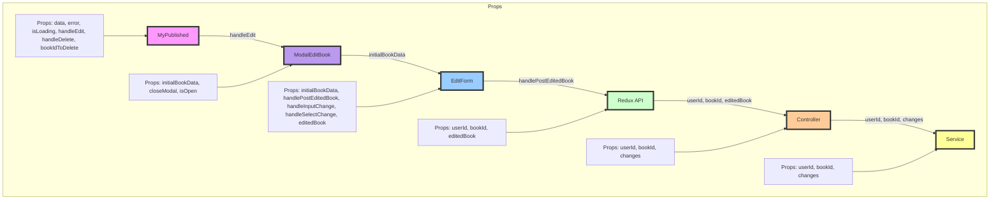
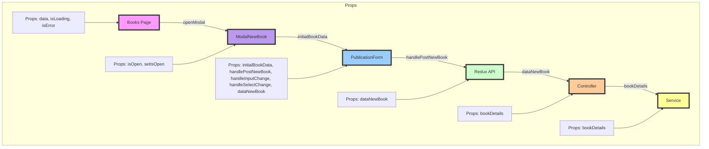
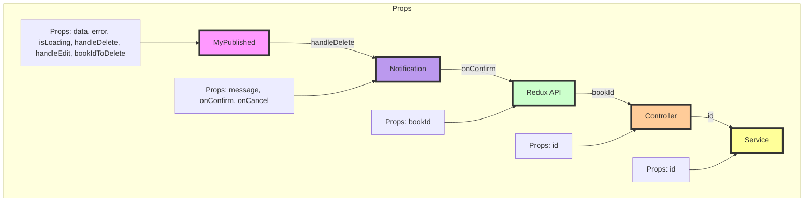

# Diagrama de Flujo Para la Edicion de un Libro

---

## Descripción de la Conexión entre Componentes

---

### MyPublished:

- **Props**: data, error, isLoading, handleEdit, handleDelete, bookIdToDelete.
- **Función principal:** Muestra la lista de libros publicados y maneja la edición/eliminación de libros.
- **Interacción:** Llama a handleEdit(book) que abre ModalEditBook.

### ModalEditBook:

- **Props:** initialBookData, closeModal, isOpen.
- **Función principal:** Muestra el formulario de edición de libro.
- **Interacción:** Pasa initialBookData a EditForm.

### EditForm:

- **Props:** initialBookData, handlePostEditedBook, handleInputChange, handleSelectChange, editedBook.
- **Función principal:** Formulario para editar los detalles del libro.
- **Interacción:** Llama a handlePostEditedBook que despacha Redux API (updateBook).

### Redux API (updateBook):

- **Props:** userId, bookId, editedBook.
- **Función principal:** Acción de Redux para actualizar un libro en el servidor.
- **Interacción:** Envia datos al Controller (updateBook).

### Controller (updateBook):

- **Props:** userId, bookId, changes.
- **Función principal:** Controlador del backend que maneja la solicitud de actualización.
- **Interacción:** Llama al Service (update).

### Service (update):

- **Props:** userId, bookId, changes.
- **Función principal:** Servicio que realiza la actualización en la base de datos.
- **Interacción:** Ejecuta la consulta SQL para actualizar el libro en la base de datos.

# Diagrama de Flujo Para la Creación de un Libro

---

## Descripción de la Conexión entre Componentes

---

### Books Page:

- **Props:** data, isLoading, isError.
- **Función principal:** Muestra la lista de libros y tiene un botón para abrir el modal de nuevo libro.
- **Interacción:** Llama a openModal para abrir ModalNewBook.

### ModalNewBook:

- **Props:** isOpen, setIsOpen.
- **Función principal:** Muestra el modal para crear un nuevo libro.
- **Interacción:** Pasa initialBookData a PublicationForm.

### PublicationForm:

- **Props:** initialBookData, handlePostNewBook, handleInputChange, handleSelectChange, dataNewBook.
- **Función principal:** Formulario para ingresar los detalles del nuevo libro.
- **Interacción:** Llama a handlePostNewBook que despacha la acción de Redux API (postNewBook).

### Redux API (postNewBook):

- **Props:** dataNewBook.
- **Función principal:** Acción de Redux para crear un nuevo libro en el servidor.
- **Interacción:** Envia dataNewBook al Controller (creteBook).

### Controller (creteBook):

- **Props:** bookDetails.
- **Función principal:** Controlador del backend que maneja la solicitud de creación.
- **Interacción:** Llama al Service (create).

### Service (create):

- **Props:** bookDetails.
- **Función principal:** Servicio que realiza la inserción en la base de datos.
- **Interacción:** Ejecuta la consulta SQL para crear el nuevo libro en la base de datos.

# Diagrama de Flujo Para la Eliminación de un Libro

---

## Descripción de la Conexión entre Componentes

---

### MyPublished:

**Props:** data, error, isLoading, handleDelete, handleEdit, bookIdToDelete.
Función principal: Muestra la lista de libros publicados y maneja la edición/eliminación de libros.
Interacción: Llama a handleDelete(bookId) que abre Notification.

### Notification:

**Props:\*\*** message, onConfirm, onCancel.
**Función principal:** Muestra una notificación de confirmación para eliminar un libro.
**Interacción:** onConfirm llama a la acción de Redux API (deleteBook).

### Redux API (deleteBook):

**Props:** bookId.
**Función principal:** Acción de Redux para eliminar un libro en el servidor.
**Interacción:** Envia bookId al Controller (deleteBook).

### Controller (deleteBook):

**Props:** id.
**Función principal:** Controlador del backend que maneja la solicitud de eliminación.
**Interacción:** Llama al Service (delete).

### Service (delete):

**Props:** id.
**Función principal:** Servicio que realiza la eliminación en la base de datos.
**Interacción:** Ejecuta la consulta SQL para eliminar el libro de la base de datos.
